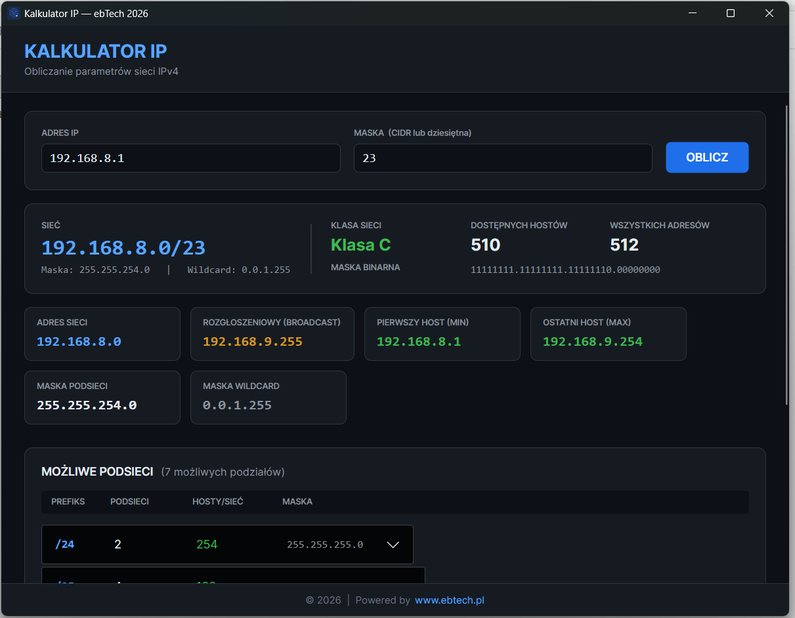

# KalkulatorIP

Desktopowa aplikacja kalkulatora podsieci IPv4 zbudowana w technologii **.NET 8 + Avalonia UI** — działa na **Windows** i **Linux**.



## Funkcje

- Akceptuje adres IP w formacie `192.168.1.0` z maską:
  - notacja CIDR: `24` lub `/24`
  - notacja dziesiętna: `255.255.255.0`
  - format łączony: `192.168.1.0/24`
- Wyznacza adres sieci i adres rozgłoszeniowy
- Oblicza minimalny i maksymalny adres hosta
- Podaje łączną i użyteczną liczbę hostów
- Określa klasę sieci (A, B, C, D Multicast, E Zarezerwowana)
- Pokazuje maskę podsieci, maskę dziką (wildcard) oraz maskę w postaci binarnej
- Generuje listę możliwych podziałów na podsieci (prefiksy /prefix+1 … /30) wraz z adresami każdej podsieci

## Wymagania

- [.NET 8 SDK](https://dotnet.microsoft.com/download/dotnet/8.0)

## Budowanie i uruchamianie

```bash
# przywróć zależności
dotnet restore

# uruchom w trybie deweloperskim
dotnet run

# publikacja dla Windows x64
dotnet publish -c Release -r win-x64 --self-contained true

# publikacja dla Linux x64
dotnet publish -c Release -r linux-x64 --self-contained true
```

## Technologie

| Warstwa | Technologia |
|---------|-------------|
| Język | C# 12 |
| Platforma | .NET 8 |
| UI | Avalonia UI |
| Cel | Windows x64, Linux x64 |
